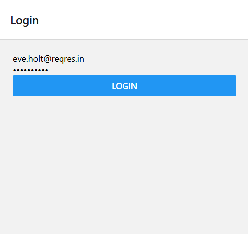
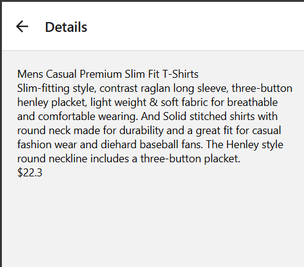

# Context API Project

## Overview
This project is a React Native application that utilizes Context API for state management. It includes authentication, product fetching, and theme management.

## Screenshots




## File Structure
```
App.js
app.json
index.js
package.json
tsconfig.json
assets/
components/
	Loader.js
contexts/
	ApiContext.js
	AuthContext.js
	LoaderContext.js
	ThemeContext.js
navigation/
	AppNavigator.js
provider/
	ApiProvider.js
	AuthProvider.js
	LoaderProvider.js
	ThemeProvider.js
screens/
	LoginScreen.js
	ProductDetailsScreen.js
	ProductListScreen.js
screenshots/
```

## Key Components
- **AppNavigator.js**: Manages navigation between screens.
- **ApiProvider.js**: Fetches products from an API.
- **AuthProvider.js**: Handles user authentication.
- **LoaderProvider.js**: Manages loading state.
- **ThemeProvider.js**: Manages theme state.

## Screens
### LoginScreen.js
- Allows users to log in with email and password.

### ProductListScreen.js
- Displays a list of products fetched from the API.

### ProductDetailsScreen.js
- Shows details of a selected product.

## Installation
1. Clone the repository.
2. Run `npm install` to install dependencies.
3. Run `npm start` to start the application.

## Usage
- Use the application to log in and view products.

## License
This project is licensed under the MIT License.